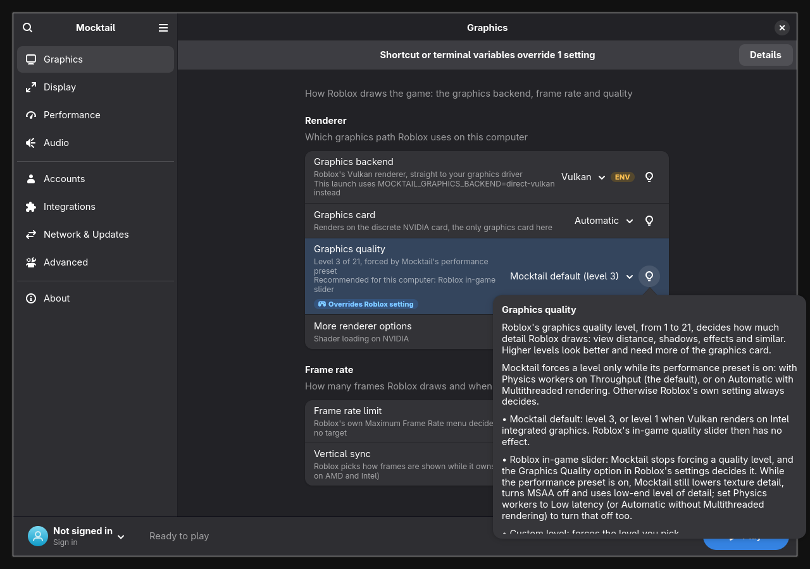
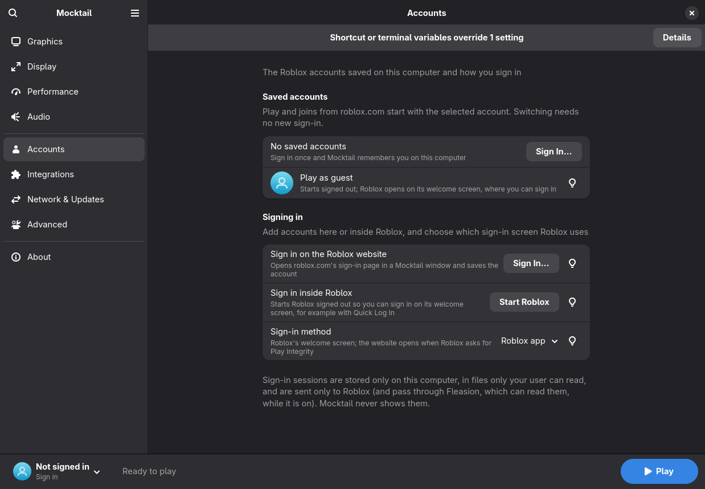
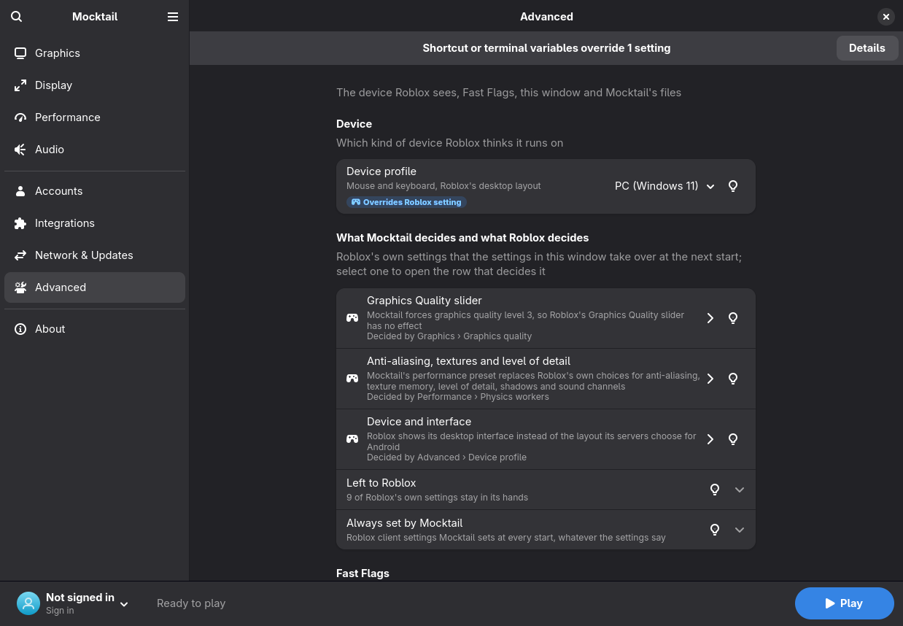

# Mocktail Plus

[](https://github.com/blackixxce12/mocktail/releases)
[](LICENSE)
[](https://github.com/komaruworld/mocktail)

**Mocktail Plus** is an unofficial fork of
[Mocktail](https://github.com/komaruworld/mocktail)
([mocktail.bigrat.space](https://mocktail.bigrat.space/)), which runs the
Android `x86_64` Roblox client on Linux. Plus is upstream Mocktail with a
settings window that opens before Roblox, fixes for signing in, buying Robux
and typing in text boxes, and NVIDIA and memory work on top. Everything else
is upstream's.

- Mocktail Plus is not affiliated with Roblox Corporation, VinegarHQ or the
  authors of Mocktail. Please report problems you only see in Plus to this
  repository, not to upstream.
- It does not distribute the Roblox client. Mocktail downloads it on the
  first start.
- It is licensed under the [Apache License 2.0](LICENSE), like upstream.
- The program is still called Mocktail: the command is `mocktail`, the app ID
  is `space.bigrat.mocktail`, and it uses the same files as upstream's
  native packages and AppImage.



## How it works

```
Roblox APK -> signature and ABI checks -> Bionic + JNI -> SDL3 + Vulkan/OpenGL
```

Mocktail provides the Android ABI and JNI pieces the client expects, then
connects them to SDL3 and Vulkan or OpenGL on the Linux side. The APK is
downloaded on first launch (`updates.source`; APKPure is currently the only
download source) and is checked before any native code is loaded. It is
not bundled with Mocktail. The last working copy is kept in case an update
fails: with `updates.automatic` on, a new Roblox version passes isolated test
runs (two when Mocktail's compatibility list does not cover it yet) before it
replaces the current one.

## What Plus changes

Plus is based on upstream `main` at
[`273209b`](https://github.com/komaruworld/mocktail/commit/273209b)
("Fix angle platform selection"), 39 commits after the 1.0.4 release, so it
already has upstream's fixes since 1.0.4, such as the chat text fixes. The
list below summarizes what Plus changes; `git log --stat 273209b..main`
shows every change, file by file.

**Settings window**

- A GTK 4 / libadwaita window (`mocktail_launcher_ui`) opens before Roblox
  starts, with pages for graphics, display, performance, audio, accounts,
  integrations, network and updates, advanced settings and system
  information. See [The settings window](#the-settings-window).
- Every setting has a hint that says what it does on this computer and what
  is recommended here, an **ENV** badge while an environment variable
  overrides it, and an **Overrides Roblox setting** badge while it takes over
  one of Roblox's own in-game settings.
- Changes are written to `config.yaml` only when you press Save or Play. The
  editor changes only the lines it has to, so comments and layout stay, and
  it keeps copies of the file before its first save, before Restore Backup
  and before Reset All Settings.
- A Fast Flags editor for `fflags.json` that points out the flags Mocktail
  manages itself.
- Variables set by a desktop shortcut or a terminal can be moved into the
  settings and removed from your copy of the desktop entry.
- New `config.yaml` sections `display`, `account`, `engine` and `launcher`
  (see [Configuration](#configuration)), the command-line options
  `--launcher` and `--play` (`--no-launcher`), and the desktop entry actions
  "Play now" and "Mocktail Settings".

**Sign-in**

- Roblox's questions about Google Play Integrity are answered as
  "unavailable". Mocktail makes up no token and no verdict.
- When Roblox's own sign-in still asks for a device check that only a
  certified device can pass (Google Play Integrity, Apple Private Access
  Token or a console's platform token), Mocktail opens roblox.com's sign-in
  page instead and restarts once you have signed in there, so Roblox starts
  signed in.
- Stale sessions: clearing the sign-in window's Roblox cookies now really
  deletes them, and a session from the website window is checked with Roblox
  before it is saved. A session Roblox refuses is not saved.
- Several Roblox accounts can be saved and switched in the settings window,
  and you can start as a guest.
- Roblox's web windows (sign-in, verification, the Robux page) open as child
  windows of the game, so the compositor knows they belong to the game
  instead of placing them as separate applications. If a compositor tiles
  one beside a fullscreen game anyway, the game goes back to fullscreen once
  it closes.

**Robux purchases**

- Mocktail has no Google Play Billing, so buying Robux used to do nothing.
  Plus opens `https://www.roblox.com/upgrades/robux` in your default web
  browser instead, both from Roblox's Robux page and from purchase prompts
  inside experiences. See [Buying Robux](#buying-robux).

**Chat and text boxes**

- Each call into Roblox's TextBox code now runs in its own JNI local frame,
  as on Android, so the references it leaves behind are freed when it
  returns, and the text box position is polled at most once every 50 ms
  while a text box has focus.

**NVIDIA and graphics**

- On a Wayland session, NVIDIA cards with direct Vulkan can run on native
  Wayland automatically when the driver and the compositor support explicit
  sync. Upstream always uses XWayland there. See [NVIDIA](#nvidia).
- `display.server` chooses Wayland or X11 (XWayland) for the game window.
- Roblox may load its shader pack on several threads on NVIDIA cards, as it
  does on Intel and AMD. Upstream always made it use one thread there;
  `engine.nvidia_shader_mt: false` brings that back.
- `engine.gpu` chooses the graphics card on computers with more than one,
  including laptops with AMD integrated graphics and an NVIDIA card, where
  upstream always used the NVIDIA card.
- `engine.graphics_quality` chooses the graphics quality level that
  Mocktail's performance preset forces, or leaves it to Roblox's slider.
- With direct Vulkan, vertical sync "On" now stays synchronized with Mesa's
  drivers (AMD, Intel, NVK) when the frame rate limit is unlimited.
- The session log names the graphics card the game renders on, and how much
  ETC2 texture decoding a session did.

**Memory**

- ETC2 texture decoding gives its scratch memory back after a loading burst
  (anything over 32 MiB). In one test in the same place, the game's
  anonymous memory went from 1817 MiB to 1455 MiB at the same frame rate.
- The description of `performance.memory_limit_mb` now says what it does: a
  watchdog stops Mocktail with exit status 137 once the game's resident
  memory plus swap reaches the limit; swap stays enabled.

**Translations**

- The settings window is in English and Russian and follows the system
  language. The desktop entry's description and its actions are in Russian
  too.

## Install

Mocktail Plus is published only as a package for CachyOS and Arch Linux on
the [Releases page](https://github.com/blackixxce12/mocktail/releases). There
is no Flatpak, AppImage, AUR, DNF or APT package of Plus.

Requirements:

- CachyOS or Arch Linux on `x86_64`. The package is built for the x86-64-v3
  level, so the CPU must support it (AVX2, BMI2, FMA and more; Intel Core
  from Haswell on and AMD Zen are new enough, but some Pentium, Celeron and
  Atom CPUs are not). `/lib/ld-linux-x86-64.so.2 --help` lists
  `x86-64-v3 (supported, searched)` on a CPU that has it.
- A Vulkan driver for the default `direct-vulkan` graphics backend, or
  OpenGL ES 3.0 for `graphics.backend: opengl`.

Download `mocktail-plus-1.0.4.plus.1-1-x86_64.pkg.tar.zst` from the
`v1.0.4-plus.1` release and install it:

```bash
sudo pacman -U ./mocktail-plus-1.0.4.plus.1-1-x86_64.pkg.tar.zst
```

The package conflicts with `mocktail`, `mocktail-bin`, `mocktail-git` and
`mocktail-local`, so it cannot be installed beside them: pacman offers to
remove the one that is installed. Start Mocktail from your application menu
or with `mocktail`. The desktop entry also opens Roblox's `roblox:` and
`roblox-player:` website links.

### Build the package yourself

- `packaging/plus/PKGBUILD` builds the tagged release: run `makepkg` in
  `packaging/plus`.
- `packaging/plus/build-release.sh --out DIR` builds the release package
  the way it is published, for the x86-64-v3 level, into `DIR/pkg`. Run it
  with `--help` for its options.

### Going back to upstream Mocktail

Plus and upstream's native packages and AppImage use the same settings and
data directories (upstream's Flatpak keeps its own under
`~/.var/app/space.bigrat.mocktail`). Upstream
Mocktail ignores the new `config.yaml` sections, so the file keeps working.
The settings window moves the saved Roblox session into its account store
(`~/.local/share/mocktail/auth/accounts/`), which upstream does not read, so
after switching back you may have to sign in again.

### Upstream Mocktail

Upstream Mocktail has its own install channels: Flathub, a nightly Flatpak,
the AUR, DNF and APT repositories, and AppImage, DEB and RPM downloads. They
install upstream Mocktail without the Plus changes; its AUR packages conflict
with `mocktail-plus`. See the
[upstream README](https://github.com/komaruworld/mocktail#readme) and
[mocktail.bigrat.space](https://mocktail.bigrat.space/) for the current
instructions.

<details>
<summary>Upstream's install commands (upstream Mocktail, not Plus)</summary>

Flathub, or the nightly Flatpak built from upstream's `main`:

```bash
flatpak install flathub space.bigrat.mocktail
flatpak install --user https://mocktail.bigrat.space/mocktail.flatpakref
```

AUR (`mocktail`, `mocktail-bin` or `mocktail-git`):

```bash
paru -S mocktail-git
# or
yay -S mocktail-git
```

Fedora 44:

```bash
sudo curl -fsSL https://mocktail.bigrat.space/rpm/mocktail.repo \
  -o /etc/yum.repos.d/mocktail.repo
sudo dnf install mocktail
# or
sudo dnf install mocktail-nightly
```

Ubuntu 26.04:

```bash
sudo install -d -m 0755 /etc/apt/keyrings
sudo curl -fsSL https://mocktail.bigrat.space/mocktail-packages.gpg \
  -o /etc/apt/keyrings/mocktail.gpg
echo "deb [arch=amd64 signed-by=/etc/apt/keyrings/mocktail.gpg] https://mocktail.bigrat.space/apt mocktail main" | \
  sudo tee /etc/apt/sources.list.d/mocktail.list >/dev/null
sudo apt update
sudo apt install mocktail
# or
sudo apt install mocktail-nightly
```

</details>

## The settings window



**When it opens.** On a normal start, from the application menu or with
`mocktail`, the settings window opens first. Press **Play** to start Roblox;
closing the window quits without starting it. The window is skipped:

- for website joins (`roblox:` and `roblox-player:` links, `--launch-uri`),
  which start with the account selected in the window;
- with `mocktail --play` (or `--no-launcher`), or the desktop entry's
  **Play now** action;
- when **Show this window on start** (Advanced page, `launcher.show_on_start`)
  is off. `mocktail --launcher` or the desktop entry's **Mocktail Settings**
  action then opens it anyway;
- for headless runs, without a display, for the update checks' test runs,
  and for the restart that follows a website sign-in.

If the window cannot start or crashes, Roblox starts as if Play was pressed.

**Pages.**

| Page | Settings |
|---|---|
| Graphics | Graphics backend, Graphics card (`engine.gpu`), Graphics quality (`engine.graphics_quality`), Multithreaded shader loading (`engine.nvidia_shader_mt`, under "More renderer options"), Frame rate limit, Vertical sync |
| Display | Window size, Start in (`display.start_mode`), Native resolution on scaled displays, Display server (`display.server`), Theme, Window title |
| Performance | Multithreaded rendering, Physics workers, GameMode, Memory limit |
| Audio | Output device, Microphone |
| Accounts | Saved accounts, Play as guest, Sign in on the Roblox website, Sign in inside Roblox, Sign-in method (`account.sign_in`) |
| Integrations | Discord Rich Presence, Fleasion |
| Network & Updates | Update Roblox automatically, Download source, Proxy, Custom CA bundle |
| Advanced | Device profile, What Mocktail decides and what Roblox decides, Fast Flags, Show this window on start, Environment variables, Files |
| About | Mocktail and Roblox versions, this computer, logs and diagnostic info |

**Hints.** Under its title, each row says what the current value does on
this computer and, when the value is not the recommended one, what is
recommended here. The info button at the end of the row (a light bulb in the
default icon theme) opens a longer explanation. **Ctrl+F** searches titles,
subtitles, `config.yaml` keys and variable names.

**Saving.** Changes stay in the window until you press **Save** (Ctrl+S).
**Play** (Ctrl+Enter) saves first. Closing the window with unsaved changes
asks whether to save them; Ctrl+Q closes it without playing. If `config.yaml`
has an error, the window says so (with the line, when the loader names one),
keeps the settings read-only and offers to open the file or reload it, to
restore the copy it kept before its first save, if there is one, and, for an
empty file, to use the defaults; Roblox cannot start until the file loads.

**Accounts.** Several Roblox accounts can be saved. Play and website joins
start with the selected one, and switching needs no new sign-in. The account
button at the bottom left switches accounts, starts as a guest, or adds and
manages accounts. Sessions are kept in files only your user can read and are
never shown in the window, in logs or on the command line.

**ENV badges.** Environment variables still win over `config.yaml` (see
[Configuration](#configuration)). When a variable from a desktop shortcut or
a terminal overrides a setting, its row shows an **ENV** badge and the value
this launch uses, and a banner says how many settings are overridden.
**Details** lists the variables and where they come from. **Move into
Settings** copies their values into the settings and leaves the variables
out of this launch. **Clean Up Shortcut** removes them from your own copy of
the desktop entry in `~/.local/share/applications`, or removes the copy when
it only added them, and keeps a backup next to it.

**Overrides Roblox setting.** Some settings replace one of Roblox's own
in-game settings, for example the graphics quality level that Mocktail's
performance preset forces. Such rows carry an **Overrides Roblox setting**
badge, and the Advanced page lists them under **What Mocktail decides and
what Roblox decides**, together with the settings left to Roblox and the
client settings Mocktail sets at every start.



The screenshots were taken during the window's self-test
(`mocktail_launcher_ui --selftest`) in a nested Hyprland session, with a
fresh `config.yaml` and a scratch home directory. The self-test sets
`MOCKTAIL_GRAPHICS_BACKEND` to show the ENV badge and the banner.

## Configuration

Mocktail reads `$XDG_CONFIG_HOME/mocktail/config.yaml` (usually
`~/.config/mocktail/config.yaml`; `MOCKTAIL_CONFIG_ROOT` replaces the
directory). It is created on the first start, with mode 0600 and a comment
for every setting. The settings window edits the same file, and you can
still edit it by hand; the window notices when the file changes while it is
open. [config/mocktail.example.yaml](config/mocktail.example.yaml) shows the
whole file.

Environment variables still override `config.yaml`. Plus adds these keys, in
new top-level sections; for each of them a variable that is set, even to an
empty value, hides the value from the file (empty means the default):

| Key | Values (default first) | Variable | What it does |
|---|---|---|---|
| `display.server` | `auto`, `wayland`, `x11` | `MOCKTAIL_DISPLAY_SERVER` | Display server for the game window. `auto` prefers Wayland, with the [NVIDIA rule](#nvidia). A server the session does not offer falls back to `auto`. `SDL_VIDEODRIVER`, `SDL_VIDEO_DRIVER` or a `MOCKTAIL_FORCE_*` switch in your environment takes precedence. |
| `display.start_mode` | `remember`, `windowed`, `maximized`, `fullscreen` | `MOCKTAIL_WINDOW_START_MODE` | Window state at start. `remember` restores the mode the last session ended in. |
| `account.sign_in` | `native`, `browser` | `MOCKTAIL_NATIVE_LOGIN` (`0` means `browser`, anything else `native`) | Where you sign in when Roblox starts without a working saved session: Roblox's own welcome screen, or Mocktail's roblox.com window. |
| `engine.graphics_quality` | `default`, `manual`, `1` to `21` | `MOCKTAIL_GRAPHICS_QUALITY` (also `auto` or `0` for `manual`) | Roblox's graphics quality level while Mocktail's performance preset is on (`performance.physics_worker_mode: throughput`, the default, or `auto` with `multithreaded_rendering`). `default` forces level 3 (level 1 with direct Vulkan on Intel integrated graphics), `manual` leaves Roblox's in-game slider in control, a number forces that level. |
| `engine.gpu` | `auto`, `discrete`, `integrated` | `MOCKTAIL_GPU` | Graphics card for direct Vulkan on computers with more than one. See [Hybrid laptops](#hybrid-laptops). |
| `engine.nvidia_shader_mt` | `true`, `false` | `MOCKTAIL_NVIDIA_SHADER_MT` (`1`/`0`, `true`/`false`, `on`/`off`) | With direct Vulkan, lets Roblox load its shader pack on several threads on NVIDIA cards. `false` makes it use one thread there, as upstream does. |
| `launcher.show_on_start` | `true`, `false` | `MOCKTAIL_LAUNCHER_SHOW_ON_START` (`1`/`0`, `true`/`false`, `on`/`off`) | Show the settings window before Roblox starts. |

A `config.yaml` from upstream Mocktail works unchanged: a missing section
means the defaults, and the settings window adds the section, with its
comments, the first time you change one of its settings.

## Signing in

The Accounts page offers three ways in:

- **Sign in on the Roblox website** opens roblox.com's sign-in page in a
  Mocktail window and saves the account.
- **Sign in inside Roblox** starts Roblox signed out, so you can use its own
  welcome screen, for example Quick Log In with a device where you are
  already signed in. The account is added to the saved accounts the next
  time the window opens.
- **Sign-in method** (`account.sign_in`) decides what happens when Roblox
  starts without a working session: Roblox's welcome screen (`native`, the
  default) or Mocktail's roblox.com window first (`browser`).

Signing in with a user name and password on Roblox's own screen may make
Roblox ask for a Google Play Integrity device check, which nothing on Linux
can pass. Plus answers Roblox's integrity questions as "unavailable", and
when Roblox asks for such a check anyway, Plus opens the roblox.com sign-in
page in a "Sign in to Roblox" window instead. Once you have signed in there,
Mocktail restarts by itself and Roblox starts signed in. The settings window
is skipped for that restart.

## Buying Robux

Mocktail has no Google Play Billing. Plus hands purchases to your web
browser:

- On Roblox's Robux page, choosing a package opens
  `https://www.roblox.com/upgrades/robux` in your default browser, and the
  page says "Opened the Robux page in your web browser. Finish your purchase
  there."
- A purchase prompt inside an experience opens the same page, shows a
  desktop notification, and tells the game that nothing was bought. After
  buying Robux in the browser, try the purchase in the experience again.

The browser uses its own roblox.com sign-in; Mocktail passes no session to
it, so sign in there with the same account.

## NVIDIA

### Display server

On a Wayland session that also has XWayland, upstream Mocktail always runs
NVIDIA cards with direct Vulkan through XWayland. Plus uses native Wayland
there when `display.server` is `auto` and all of these hold, checked in this
order:

1. `MOCKTAIL_PREFER_WAYLAND` is not `0` or `false`, and the surface-commit
   guard is on (it is unless `MOCKTAIL_WAYLAND_COMMIT_GUARD` is `0`, `false`,
   `off` or `no`). The guard keeps SDL's own surface commits from landing in
   the middle of NVIDIA's explicit-sync present, which would be a fatal
   Wayland protocol error.
2. The NVIDIA driver is version 555 or newer (explicit sync in its Vulkan
   driver), and `__NV_DISABLE_EXPLICIT_SYNC` is unset or `0`.
3. There is no Intel or AMD graphics card beside the NVIDIA one (presenting
   through PRIME is untested).
4. The compositor offers explicit sync (`wp_linux_drm_syncobj_manager_v1`).
5. The compositor is Hyprland, or the game does not wait for the display:
   `graphics.vsync: off`, or `auto` with `frame_rate_limit: unlimited`. With
   vertical sync, NVIDIA's Wayland driver can stall the game's rendering
   while its window is hidden (seen in GNOME).

Otherwise the game uses XWayland. A session without XWayland always uses
Wayland. The Display page's **Display server** row says what Automatic picks
on your computer and why, and so does the session log, for example:

```
[window] NVIDIA 615.71.09 direct Vulkan on Wayland: the compositor offers explicit sync (wp_linux_drm_syncobj_manager_v1) and is Hyprland; using the native Wayland WSI with the surface-commit guard; set display.server: x11 or SDL_VIDEODRIVER=x11 to override
```

That was the choice on an RTX 3060 Laptop GPU with driver 615.71.09 on
Hyprland. `display.server: x11` or `wayland` overrides the rule.

### Multithreaded shader loading

With direct Vulkan, upstream Mocktail makes Roblox load its shader pack on a
single thread on every NVIDIA card. Plus leaves that to Roblox's own
setting, which loads it on several threads, as on Intel and AMD. If shader loading fails on your
NVIDIA card, set `engine.nvidia_shader_mt: false` (Graphics page, More
renderer options, **Multithreaded shader loading**) or
`MOCKTAIL_NVIDIA_SHADER_MT=0`.

### ETC2 textures

NVIDIA's Vulkan driver has no ETC2 texture support. Mocktail tells Roblox
that ETC2 is supported anyway and decodes those textures on the CPU into
uncompressed ones (RGBA8, and 16-bit formats for EAC).
`MOCKTAIL_ADVERTISE_ETC2=0` stops that, and Roblox then uses DXT/BC
textures, which NVIDIA cards support natively. Plus keeps ETC2 on by default
because it was much faster in a test:

| Same place and server | ETC2 (default) | `MOCKTAIL_ADVERTISE_ETC2=0` |
|---|---|---|
| Main menu | 113–123 fps | 53–56 fps |
| In game | 158–164 fps | about 62 fps |
| CPU use | about 2.3 cores | about 3.7 cores |
| Video memory of the game | about 1165 MiB | about 660–700 MiB |

The test ran Roblox 2.738.1397 in Greenville RP on an RTX 3060 Laptop GPU
with driver 615.71.09 on Hyprland, on the same server for each pair of runs.
The textures looked the same. With DXT/BC the extra work is on Roblox's own
render thread inside `libroblox` (profiled), and it does not depend on
Mocktail's performance preset: with the preset off it was 123 fps with ETC2
against 38 fps with DXT/BC. What ETC2 costs is the video memory above and
decoding while a place loads; the longest decoding stall was about 0.5 s.
The session log reports the decoding in a line like
`[vulkan] ETC2 decode totals: images=... uploads=... compressed=... host=... decode=... longest=...`.

## Hybrid laptops

`engine.gpu` (Graphics page, **Graphics card**) picks the card that direct
Vulkan renders on when the computer has more than one:

- `auto` prefers the discrete card, unless `DRI_PRIME` or
  `__NV_PRIME_RENDER_OFFLOAD` is `0`, `off` or `igpu`;
- `discrete` and `integrated` pick that kind of card; when no such card has
  a Vulkan driver, another card stands in;
- a computer with one card always uses it, and a driver list you set in
  `VK_DRIVER_FILES` or `VK_ICD_FILENAMES` wins over all of this.

Plus finds the cards under `/sys/class/drm`, tells integrated from discrete
by their PCI position, and pins the chosen card's Vulkan driver. The session
log names the card in a line like
`[runtime] vulkan GPU=NVIDIA 10de:2520 discrete at 0000:01:00.0 ICD=...`.
On a laptop with Intel or AMD graphics beside an NVIDIA card, the
[display server rule](#display-server) keeps the game on XWayland while it
renders on the NVIDIA card; on the integrated card it prefers Wayland as
usual.

## FFlag overrides

Put a JSON object in `$XDG_CONFIG_HOME/mocktail/fflags.json` (usually
`~/.config/mocktail/fflags.json`), or use the Fast Flags editor on the
Advanced page. Mocktail applies it on the next launch.

PC profiles use the legacy Charts page by default to avoid the blank screen
caused by `Color3` errors in the newer SDUI page. An explicit
`FFlagLuaAppChartsAppPage` override takes precedence over this default.

```json
{
  "FFlagExample": "True",
  "DFIntExample": "120"
}
```

## Troubleshooting

- Logs: `~/.local/state/mocktail/logs/latest.log` (a custom
  `$XDG_STATE_HOME` replaces `~/.local/state`). The settings window opens the
  folder from its main menu and from the About page, which can also copy
  diagnostic info. Attach `latest.log` to a bug report.
- Mocktail does not currently work with `hardened_malloc`, which may make it
  fail to start or crash. Run Mocktail without `hardened_malloc`.
- More answers are in the [FAQ](FAQ.md).

## Building from source

Linux `x86_64` is supported. Upstream also builds for Linux `aarch64` (with
Roblox runtime validation still experimental) and runs in a Linux userspace
under FreeBSD 15.1's Linuxulator, tested with an `x86_64` Fedora 44
userspace; see the [FreeBSD Guide](packaging/freebsd/README.md). The Plus
changes have been built and tested only on `x86_64` Linux.

Building requires CMake 3.20+, Git, pkg-config, LLD, binutils, a C++17
compiler, SDL 3.4+, SDL3_ttf, Vulkan, EGL, libplacebo, fontconfig, libcurl,
OpenSSL, libelf, libyaml, minizip, Capstone 5, utf8proc, nlohmann/json, GTK4,
libadwaita 1.6+ and WebKitGTK 6.0. The settings window also needs
libadwaita 1.9+ and `msgfmt` from gettext. Without them, configure with
`-DMOCKTAIL_BUILD_LAUNCHER_UI=OFF`; Mocktail then starts Roblox directly.

<details>
<summary>Ubuntu 26.04+</summary>

```bash
sudo apt update
sudo apt install build-essential cmake git ninja-build pkg-config lld \
  libsdl3-dev libsdl3-ttf-dev libcurl4-openssl-dev libssl-dev \
  nlohmann-json3-dev libyaml-dev libelf-dev libminizip-dev \
  libcapstone-dev libgtk-4-dev libadwaita-1-dev libwebkitgtk-6.0-dev \
  libutf8proc-dev libfontconfig1-dev libegl-dev libvulkan-dev \
  libplacebo-dev libpng-dev zlib1g-dev gettext
```
</details>

<details>
<summary>Arch Linux</summary>

```bash
sudo pacman -S --needed base-devel cmake git ninja pkgconf lld sdl3 sdl3_ttf \
  curl openssl nlohmann-json libyaml libelf minizip capstone gtk4 \
  libadwaita webkitgtk-6.0 libutf8proc fontconfig libglvnd \
  libplacebo vulkan-headers vulkan-icd-loader zlib gettext
```
</details>

<details>
<summary>Fedora 44+</summary>

```bash
sudo dnf install gcc-c++ cmake git ninja-build pkgconf-pkg-config lld \
  SDL3-devel SDL3_ttf-devel libcurl-devel openssl-devel \
  nlohmann-json-devel libyaml-devel elfutils-libelf-devel minizip-ng-compat-devel \
  capstone-devel gtk4-devel libadwaita-devel webkitgtk6.0-devel \
  utf8proc-devel fontconfig-devel libglvnd-devel vulkan-headers \
  vulkan-loader-devel libplacebo-devel zlib-ng-compat-devel gettext
```
</details>

```bash
git clone --recurse-submodules https://github.com/blackixxce12/mocktail.git
cd mocktail
make build
./build/mocktail
```

## Development

- `main` is upstream Mocktail's `main` at `273209b` with the Plus commits on
  top; `git log 273209b..main` lists them. The files for upstream's install
  channels (Flatpak, AUR, Arch, DEB, RPM, AppImage) and its CI workflows stay
  in the tree for upstream; Plus release packages are built with
  `packaging/plus`.
- `make test` builds and runs the unit tests. The settings window has a
  self-test, `mocktail_launcher_ui --selftest OUT_DIR`, that opens the real
  window on a scratch configuration, goes through every page, saves and
  checks the result, renders each page to a PNG and writes `report.json`.
- Most Plus changes were written with
  [Claude Code](https://claude.com/claude-code) (AI-assisted). Every such
  commit carries the trailer
  `Co-Authored-By: Claude Opus 5.5 <noreply@anthropic.com>`.

## License and credits

[Apache License 2.0](LICENSE). Third-party components keep their own
licenses.

Mocktail is by komaruworld and its contributors; Mocktail Plus only adds to
their work. Upstream's code, website and community are at
[github.com/komaruworld/mocktail](https://github.com/komaruworld/mocktail),
[mocktail.bigrat.space](https://mocktail.bigrat.space/) and its
[Discord server](https://discord.gg/rhgpfcmFSD). To support upstream's
authors, see the Support section of the
[upstream README](https://github.com/komaruworld/mocktail#support).

<details>
<summary>Roblox in Mocktail (screenshots from upstream)</summary>


</details>
